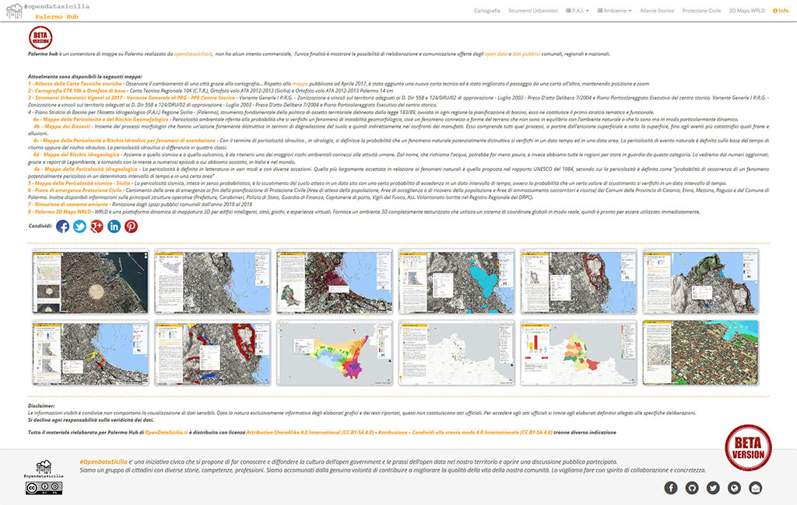

# PalermoHub
Palermo Hub di [**opendatasicilia.it**](http://opendatasicilia.it/) è un contenitore di mappe realizzate/rielaborate da liberi cittadini o da civic hackers prevalentemente sul territorio comunale di Palermo, non ha alcun intento commerciale, l’unica finalità è mostrare le possibilità di rielaborazione e comunicazione offerte dagli open data o dati pubblici comunali, regionali e nazionali.  
a cura di [@gbvitrano](https://twitter.com/gbvitrano)

Il progetto è stato spostato a questo [**nuovo indirizzo**](https://siciliahub.github.io/palermohub/index.html/)   a cura di [@gbvitrano](https://twitter.com/gbvitrano)
